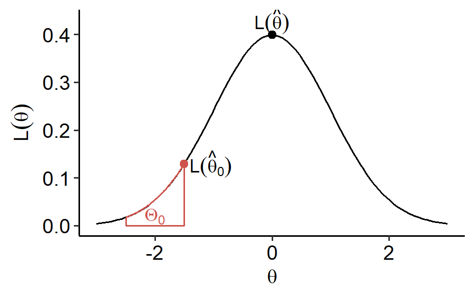

In the previous section, we considered the situation where we

-   Test $H_0$: $\theta = \theta_0$ vs. $H_a$: $\theta = \theta_a$ using rejection rule $\frac{L(\theta_0)}{L(\theta_a)} < k_\alpha$.
-   Test $H_0$: $\theta = \theta_0$ vs. $H_a$: $\theta \in \Theta_a$ (typically one-sided) using the rejection rule $\frac{L(\theta_0)}{L(\theta_a)} < k_\alpha$ if it does not depend on $\theta \in \Theta_a$.

Beyond these situations, there's many other cases, such as

-   What if $H_0: \theta \in \Theta_0$ is composite?
-   What if the rejection rule depends on $\theta \in \Theta_a$?
-   What if the alternative is two-sided?

Our goal is to develop a universal test based on the idea of using the ratio of the likelihoods. This is probably the most important material in this chapter, and it's the fundamental way of constructing statistical tests.

## Definition

The `likelihood ratio test` (LRT) is given by the following ingredients. We have a likelihood function $L(\theta)$ where $\theta \in \Theta$. The hypotheses are

$$
H_0: \theta \in \Theta_0 \quad vs. \quad H_a: \theta \in \Theta_a, \quad \Theta = \Theta_0 \cup \Theta_a
$$

The test statistic is given by

$$
R = \frac{\max_{\theta \in \Theta_0}L(\theta)}{\max_{\theta \in \Theta}L(\theta)} = \frac{L(\hat\theta_0)}{L(\hat\theta)}
$$

where $\hat\theta_0$ is the MLE constrained in $\Theta_0$ and $\hat\theta$ is the MLE on $\Theta$[^plot-code]. They can be used to replace the maximums in the definition. Equivalently, one can work with $\ln R = \ln L(\hat\theta_0) - \ln L(\hat\theta)$.



The rejection region is $RR = \\{r: r < k_\alpha\\}$, i.e. we reject $H_0$ if $R < k_\alpha$, and $k_\alpha$ is chosen to ensure the level $\alpha$.

{}
In the denominator of $R$, the max is taken over $\Theta$, not $\Theta_a$.
{}

Note that $0 \leq R \leq 1$ since $\Theta_0$ is smaller than $\Theta$. When $R$ is large, it is likely $\hat\theta$ is close to $\hat\theta_0 \in \Theta_0$, which implies that $\theta \in \Theta_0$ is likely. On the other hand when $R$ is small, it's likely $\hat\theta$ is away from $\Theta_0$, thus it's likely $\theta \notin \Theta_0$.

**Corollary:** If $H_0$ and $H_a$ are simple, then the LRT coincides with the test given in the Neyman-Pearson lemma, i.e. the LRT is the most powerful test in this case.

This is easily proven because $\Theta_0$ and $\Theta_a$ only contain $\theta_0$ and $\theta_a$, respectively. The likelihood ratio is given by

$$
R = \frac{\max_{\theta \in \Theta_0} L(\theta)}{\max_{\theta \in \Theta} L(\theta)} = \frac{L(\theta_0)}{\max\\{L(\theta_0), L(\theta_a)\\}} = \frac{1}{\max\left\\{ 1, \frac{L(\theta_a)}{L(\theta_0)} \right\\}}
$$

which can be alternatively expressed as

$$
R = \min \left\\{ 1, \frac{L(\theta_0)}{L(\theta_a)} \right\\}
$$

So we reject $H_0$ if $R < k_\alpha < 1$, and this is the same as what we've found in the Neyman-Pearson lemma.

### Example

Suppose $Y_i \overset{i.i.d.}{\sim} N(\mu, \sigma^2)$. Here $\vec\theta = (\mu, \sigma^2) \in \mathbb{R} \times (0, \infty)$. We want to test $H_0$: $\mu = \mu_0$ vs. $H_a$: $\mu \neq \mu_0$. Recall that

$$
\begin{gathered}
  L(\theta) = L(\mu, \sigma^2) = \frac{1}{(2\pi\sigma^2)^\frac{n}{2}}\exp\left\\{ -\frac{\sum_{i=1}^n (Y_i - \mu)^2}{2\sigma^2} \right\\} \\\\
  \ell(\theta) = -\frac{n}{2}\ln(\sigma^2) - \frac{1}{2\sigma^2}\sum_{i=1}^n (Y_i - \mu)^2 - \frac{n}{2}\ln 2\pi
\end{gathered}
$$

Under $H_0$, we have the restriction $\mu = \mu_0$, and we can derive the MLE

$$
\hat\theta_0 = (\mu_0, \hat\sigma_0^2) = \left(\mu_0, \frac{1}{n}\sum_{i=1}^n (Y_i - \mu_0)^2 \right)
$$

Without the restriction, the MLE can be found by taking partial derivatives (Example 9.15 in the textbook)

$$
\hat\theta = (\hat\mu, \hat\sigma^2) = \left( \bar{Y}_n, \frac{1}{n}\sum\_{i=1}^n (Y_i - \bar{Y}_n)^2 \right)
$$

So by the definition of the LRT, we reject $H_0$ if

$$
\ell(\hat\theta_0) - \ell(\hat\theta) = \frac{n}{2}\ln \left(\frac{\hat\sigma^2}{\hat\sigma_0^2} \right) - \frac{n}{2} + \frac{n}{2} < c_\alpha
$$

which is equivalent to $\frac{\hat\sigma^2}{\hat\sigma_0^2}< a_\alpha$ for some $a_\alpha$ since the left-hand-side is an increasing function of $\frac{\hat\sigma^2}{\hat\sigma_0^2}$. Since $\sum_{i=1}^n (Y_i - \bar{Y}_n) = 0$, we have

$$
\begin{gathered}
  \frac{\hat\sigma^2}{\hat\sigma_0^2} = \frac{\sum_{i=1}^n (Y_i - \bar{Y}_n)^2}{\sum_{i=1}^n (Y_i - \mu_0)^2} = \frac{\sum_{i=1}^n (Y_i - \bar{Y}_n)^2}{\sum_{i=1}^n (Y_i - \bar{Y}_n)^2 + n(\bar{Y}_n - \mu_0)^2} \\\\
  = \frac{1}{1 + \frac{1}{n-1} \frac{n(\bar{Y}_n - \mu_0)^2}{\frac{1}{n-1} \sum_{i=1}^n (Y_i - \bar{Y}_n)^2}} = \frac{1}{1 + \frac{1}{n-1}T_n^2} \\\\
  T_n = \frac{\bar{Y}_n - \mu_0}{\sqrt{\frac{1}{n-1}\sum_{i=1}^n (Y_i - \bar{Y}_n)^2 / n}}
\end{gathered}
$$

We can see that $T_n$ is the $t$-statistic for a two-sided $t$-test used in [a previous section](). The expression above is a decreasing function of $|T_n|$, so the rejection rule can be expressed as

$$
|T_n| > t_\frac{\alpha}{2}(n-1)
$$

From the LRT point of view, we eventually derived the small-sample t-test. The LRT may not always be UMP, but it has nice large-sample properties.

## Large-sample properties

**Theorem:** Suppose we have an i.i.d. sample of size $n$ and some additional conditions hold. Assume $\Theta_0$ has $d_0$ free parameters while $\Theta$ has $d$ free parameters[^free-params]. Then under $H_0$, as $n \rightarrow \infty$,

$$
-2\ln(R) \xrightarrow{d} \chi^2(d - d_0)
$$

where "$\xrightarrow{d}$" stands for convergence of CDFs, i.e. convergence in distribution.

$\Theta_0$ is often obtained by adding restricting relations in $\Theta$. For example, suppose $\Theta = \\{(\theta_1, \theta_2, \theta_3)\\}$ and $\Theta_0 = \\{(\theta_1, \theta_2, \theta_3): \theta_1 = \theta_2 \\}$. We then have $d = 3$ and $d_0 = 2$. If the restriction (or $H_0$) was $\theta_1 = \theta_2 = \theta_3$, then $d_0 = 1$.

{}
The theorem is not applicable when $d = d_0$, e.g. when testing $H_0: \theta < 0$ vs. $H_a$: $\theta \geq 0$. It's fine for $d_0 = 0$, which means $H_0$ is a simple hypothesis.
{}

The theorem provides a convenient large-sample decision rule. When $n$ is large, we reject $H_0$ if $R < k_\alpha$, or $-2\ln(R) > c_\alpha$. So to ensure the level $\alpha$, we want

$$
P_{\theta \in \Theta_0}(-2\ln(R) > c_\alpha) \approx P \left(\chi^2(d - d_0) > c_\alpha \right) = \alpha
$$

So $c_\alpha = \chi^2_\alpha(d - d_0)$. Therefore, we have a decision rule where we reject $H_0$ when

$$
-2\ln(R) > \chi^2_\alpha(d - d_0)
$$

In practice, we often cannot compute the MLEs explicitly. Going back to the [definition](#definition), the test statistic $R$ just involves two maximization problems, so we can use optimization software to efficiently find the numerical results.

### Revisiting the example

In the [example](#example) we had $d_0 = 1$ and $d = 2$. By applying the theorem, when $n$ is large,

$$
-2\ln(R) \overset{d}{\approx} \chi^2(2-1)
$$

One may reject $H_0$ when $-2\ln(R) > \chi^2_\alpha(1)$. To see how this is consistent with our derivation above, recall the identity

$$
\left(1 + \frac{x}{n-1} \right)^n \approx e^x
$$

when $n$ is large, so we have

$$
-2\ln(R) = -n\ln\left(\frac{\hat\sigma^2}{\hat\sigma_0^2}\right) = \ln\left[ \left(1 + \frac{1}{n-1}T_n^2\right)^n \right] \approx T_n^2 \overset{d}{\approx} \chi^2(1)
$$

since $T_n \overset{d}{\approx} N(0, 1)$ when $n$ is large.

## Other common tests

For hypotheses $H_0$: $\theta = \theta_0$ vs. $H_a$: $\theta \neq \theta_0$, there's other common likelihood-based tests. Recall the [score]() function

$$
S_n(\theta) = \frac{d}{d\theta}\ell_n(\theta)
$$

and the [Fisher information]()

$$
I_n(\theta) = Var(S_n(\theta)) = -E\left[S_n'(\theta_0) \right]
$$

The `Wald test` is the Z-test in the context of the MLE $\hat\theta_n$. Under $H_0$,

$$
T = \frac{\hat\theta_n - \theta_0}{\hat\sigma} \sim N(0, 1)
$$

where $\hat\sigma = \frac{1}{I_n(\hat\theta_n)}$.

Under $H_0$, the `score test`

$$
\frac{S_n(\theta_0)^2}{I_n(\theta_0)} \sim \chi^2(1)
$$

The two tests are asymptotically equivalent under $H_0$ since

$$
\frac{\hat\theta_n - \theta_0}{\hat\sigma} \approx \frac{S_n(\theta_0)}{\sqrt{I_n(\theta_0)}}
$$

Both tests can be extended to composite $H_0$ and multivariate $\theta$ cases.

[^plot-code]:
    ```r
    ggplot(NULL, aes(x = c(-3, 3))) +
      stat_function(fun = dnorm, geom = "line") +
      stat_function(fun = dnorm, xlim = c(-2.5, -1.5), geom = "area",
                    color = "#CD534C", fill = NA, alpha = 0.4) +
      geom_point(aes(x = -1.5, y = dnorm(-1.5)), color = "#CD534C", size = 2) +
      geom_point(aes(x = 0, y = dnorm(0)), size = 2) +
      annotate("text", x = -2, y = 0.02, color = "#CD534C",
               label = "Theta[0]", parse = T) +
      annotate("text", x = -1.05, y = 0.13,
               label = "L(hat(theta)[0])", parse = T) +
      annotate("text", x = 0, y = 0.43,
               label = "L(hat(theta))", parse = T) +
      labs(x = expression(theta), y = expression(L(theta))) +
      ggpubr::theme_pubr()
    ```

[^free-params]: Or, degrees of freedom.
