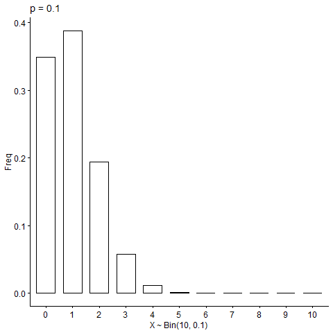

In this section, we present some specific types of discrete random variables and derive their probability distributions, expectations and variances.

## The binomial probability distribution

Suppose a random experiment has a binary outcome (1 or 0, success or failure, etc.). Let $X$ be a random variable that indicates the result of this random experiment. The PMF of $X$ can be written as
$$
P(i) = \begin{cases}
    p, & i=1 \\\\
    1-p, & i=0
\end{cases}
$$


where $0 \leq p \leq 1$. Then we say $X \sim Bern(p)$, meaning $X$ is a `Bernoulli random variable` with parameter $p$, or $X$ is drawn from a Bernoulli distribution with parameter $p$.

A `binomial` experiment is a random experiment that contains $n$ independent and identical Bernoulli experiments. For example, tossing a coin $n$ times. Denote $Y$ as the number of successes observed in the $n$ trails. Then $Y \sim Bin(n, p)$ where $p$ is the probability of success in each trail. $Y$ can take any integer value from $k = 0, 1, \cdots, n$. The PMF is
$$
P(k) = \binom{n}{k} p^k(1-p)^{n-k}, \quad k = 0, 1, \cdots, n
$$


<figcaption data-pre="Figure " data-post=":" class="numbered">
    Binomial distribution with $n=10$ and different $p$ parameters.
  </figcaption>

Above is a visualization of the binomial distribution with different values for $p$[^binom-gif]. We can also see that the Bernoulli distribution is a special case of the binomial distribution where $n=1$.

### Properties

We first want to check that $\sum_i P(i) = 1$ since it's a distribution function. Then we would derive the expectataion and variance of the two distributions.

Doing so for the Bernoulli distribution is straightforward:
$$
\begin{aligned}
    \sum_i P(i) &= P(0) + P(1) = 1 - p + p = 1 \\\\
    E(X) &= \sum_{i=0}^1iP(i) = 0(1-p) + p = p \\\\
    Var(X) &= E(X^2) - E(X)^2 \\\\
    &= \sum_{i=0}^1 i^2P(i) - p^2 = p - p^2 = p(1-p)
\end{aligned}
$$
For the binomial distribution, we know that
$$
\begin{equation} \label{eq:binom-1}
    \sum_{i=0}^np(i) = \sum_{i=0}^n\binom{n}{i}p^i(1-p)^{n-i} 
\end{equation}
$$
The `binomial expansion` is given by
$$
\begin{gather*}
	(a + b)^2 = a^2 + 2ab + b^2 = a^2b^0 + 2a^1b^1 + a^0b^2 \\\\
	(a + b)^n = \sum_{k=0}^n C_k a^{n-k}b^k = \sum_{k=0}^n \binom{n}{k} a^{n-k}b^k
\end{gather*}
$$
Now going back to Equation $\eqref{eq:binom-1}$, we have
$$
\sum_{i=0}^n\binom{n}{i}p^i(1-p)^{n-i} = (p + (1-p))^n = 1
$$
The expected value of a binomial random variable is
$$
E[X] = np
$$


**Lemma:** Suppose we have $X \sim Bin(n, k)$ and $Y \sim Bin(n-1, k)$. We can show that
$$
\begin{equation} \label{eq:binom-lemma}
    E[X^k] = npE\left[(Y+1)^{k-1}\right]
\end{equation}
$$
if this equation holds, we can get $E[X]$ by setting $k=1$.
$$
\begin{aligned}
    E[X^k] &= \sum_X x^kp(x) = \sum_{i=0}^n {i^k \binom{n}{i}p^i(1-p)^{n-i}} \\\\
    &= \sum_{i=1}^n {i^k \binom{n}{i}p^i(1-p)^{n-i}} \quad \cdots\text{first term is 0} \\\\
    &= \sum_{i=1}^n {i^{k-1} n\binom{n-1}{i-1}p^i(1-p)^{n-i}} \quad \cdots i\binom{n}{i} = n\binom{n-1}{i-1} \\\\
    &= np \sum_{i=1}^n {i^{k-1} n\binom{n-1}{i-1}p^{i-1}(1-p)^{n-i}}
\end{aligned}
$$
Let $i = j + 1$, we have
$$
\begin{aligned}
    E[X^k] &= np \sum_{j=0}^{n-1}{(j+1)^{k-1}\binom{n-1}{j}p^j(1-p)^{n-j-1}} \\\\
    &= np E\left[(y+1)^{k-1}\right]
\end{aligned}
$$
For $Var(X)$, we just need to figure out $E[X^2]$. Setting $k=2$ for Lemma $\eqref{eq:binom-lemma}$, we have
$$
\begin{aligned}
	E[X^2] &= npE([Y+1]) = np(E[Y] + 1) \\\\
	&= np((n-1)p + 1) = n^2p^2 + (1-p)np
\end{aligned}
$$


because $Y \sim Bin(n-1, p)$. So the variance of $X$ is
$$
Var(X) = n^2p^2 + (1-p)np - n^2p^2 = np(1-p)
$$


The binomial distribution has many applications, such as modeling defectives in quality control, or anything else that can be put into a success-failure setting. 

## The geometric probability distribution

Suppose we have a Binomial experiment which consists of some independent and identical Bernoulli experiments with probability of success $p$. We can define $Y$ as a random variable to describe the number of trials until the first success. For example, if we're tossing a coin for $n$ times, $Y$ will be the number of the toss on which a head first appears.
$$
\begin{gather*}
    \\{Y=1\\} && p \\\\
    \\{Y=2\\} && (1-p)p \\\\
    \vdots && \vdots \\\\
    \\{Y=n\\} && (1-p)^{n-1}p
\end{gather*}
$$
$Y$ is said to have a `geometric probability distribution` if and only if
$$
P(Y=y) = q^{y-1}p, \quad y = 1, 2, 3, \cdots
$$
where $0 \leq p \leq 1$ and $q = 1-p$.

### Properties

As required for any valid discrete probability distribution, the probabilities should add up to 1.
$$
\sum_{i=1}^\infty p(i) = p\sum_{i=1}^\infty q^{i-1}
$$
We know the `geometric sequence`
$$
\begin{aligned}
    \sum_{i=1}^\infty q^{i-1} &= 1 + q + q^2 + q^3 + \cdots \quad \text{if } 0 \leq q < 1 \\\\
    &= \frac{1}{1-q} = \frac{1}{p}
\end{aligned}
$$


For the expectation of $X$, we have
$$
\begin{aligned}
    E[X] &= \sum_{i=1}^\infty iq^{i-1}p \\\\
    &= \sum_{i=1}^\infty (i+1-1)q^{i-1}p \\\\
    &= \sum_{i=1}^\infty (i-1)q^{i-1}p + \sum_{i=1}^\infty q^{i-1}p \\\\
    &= \sum_{i=1}^\infty{(i-1)q^{i-1}p} + 1 \\\\
    &= \sum_{j=0}^\infty{jq^j p} + 1, \quad j = i-1 \\\\
    &= q \sum_{j=1}^\infty{jq^{j-1}p} + 1 \\\\
    &= qE(X) + 1
\end{aligned}
$$


Rearranging terms would give us
$$
E(X) = \frac{1}{1-q} = \frac{1}{p}
$$


With the expectation of $X$ known, it's easy to get the variance of $X$ once we find $E[X^2]$


$$
\begin{aligned}
    E[X^2] &= \sum_{i=1}^\infty i^2pq^{i-1} \\\\
    &= \sum_{i=1}^\infty (i-1+1)^2pq^{i-1} \\\\
    &= \sum_{i=1}^\infty \left((i-1)^2 + 2(i-1) + 1^2\right)pq^{i-1} \\\\
    &= \sum_{i=1}^\infty (i-1)^2pq^{i-1} + 2\sum_{i=1}^\infty (i-1)pq^{i-1} + \sum_{i=1}^\infty pq^{i-1} \\\\
    &= \sum_{j=0}^\infty j^2pq^j + 2\sum_{j=0}^\infty jpq^j + p\sum_{i=1}^\infty q^{i-1}, \quad j = i-1 \\\\
    &= q\sum_{j=1}^\infty j^2pq^{j-1} + 2q\sum_{j=1}^\infty jpq^{j-1} + 1 \\\\
    &= qE[X^2] + 2qE[X] + 1 \\\\
    &\Rightarrow (1-q)E[X^2] = \frac{2q}{p} + 1 \\\\
    E[X^2] &= \frac{2-p}{p^2}
\end{aligned}
$$


The variance is thus
$$
\begin{aligned}
	Var(X) &= E[X^2] - E[X]^2 \\\\
  &= \frac{2-p}{p^2} - \frac{1}{p^2} = \frac{1-p}{p^2}
\end{aligned}
$$


The geometric probability distribution is often used to model the distributions of lengths of waiting times. For example, the probability of engine malfunction during any randomly observed time intervals is $p$, and the length of time until the first malfunction $Y$ can be modeled using the geometric distribution.


## The Poisson probability distribution

The Poisson random variable has a range of infinite size. It takes values in the set $\\{0, 1, 2, \cdots\\}$. We'll learn about this random variable through an example.

Suppose we're performing quality control for a mobile phone company. Each phone made has a **small chance** to be defect. The average number of defect phones produced per day is $\lambda$. Find the probabilty of producing $k$ defect phones on a usual day.

First, we may assume that the production of each phone is a random variable of two outcomes: $0$ or $1$, or $Y_i \sim Bern(p)$ where $Y_i$ is the $i^{th}$ phone with probability $p$ to be defect. In addition, we assume that there are $n$ phones produced, and the production of the phones are independent and share the same defect probability $p$. Define
$$
X = \text{number of defect phones produced} \sim Bin(n, p)
$$
Then the probability of producing $k$ defect phones can be calculated using the probability mass function of $X$ at $k$:
$$
\begin{equation} \label{eq:binom-pmf}
    P\\{X = k\\} = \binom{n}{k}p^k(1-p)^{n-k}, \quad k \in \\{0, 1, \cdots, n\\}
\end{equation}
$$


Our problem now is we don't know $n$ and $p$ explicitly. But what we do know is on average there are $\lambda$ defect phones produced per day, which gives
$$
E[X] = np = \lambda \Rightarrow p = \frac{\lambda}{n}
$$
Now we can replace the $p$ variable in Equation $\eqref{eq:binom-pmf}$ with $\frac{\lambda}{n}$, and write out the probability mass function as


$$
\begin{aligned}
    P(X = k) &= \binom{n}{k}\left(\frac{\lambda}{n}\right)^k\left(1 - \frac{\lambda}{n}\right)^{n-k} \\\\
    &= \frac{n!}{k!(n-k)!} \cdot \frac{\lambda^k}{n^k} \cdot \frac{\left(1 - \frac{\lambda}{n}\right)^n}{\left(1 - \frac{\lambda}{n}\right)^k} \\\\
    &= \underbrace{\frac{n(n-1)\cdots(n-k+1)}{n^k}}\_{I(n)} \cdot \frac{\lambda^k}{k!} \cdot \underbrace{\frac{\left(1 - \frac{\lambda}{n}\right)^n}{\left(1 - \frac{\lambda}{n}\right)^k}}\_{II(n)}
\end{aligned}
$$


Though we don't know $n$ exactly, it's reasonable to assume that it's a very large number, so we can let $n \rightarrow \infty$ to study it in an asymptotic way.
$$
\begin{aligned}
    \lim_{n \rightarrow \infty} I(n) &= \lim_{n \rightarrow \infty} \frac{n(n-1)\cdots (n-k+1)}{n^k} \\\\
    &= \lim_{n \rightarrow \infty} 1 \times \frac{n-1}{n} \times \frac{n-2}{n} \times \cdots \times \frac{n-k+1}{n} \\\\
    &= 1 \\\\
    \lim_{n \rightarrow \infty} II(n) &= \lim_{n \rightarrow \infty}\frac{\left(1 - \frac{\lambda}{n}\right)^n}{\left(1 - \frac{\lambda}{n}\right)^k} \\\\
    &= e^{-\lambda}
\end{aligned}
$$
where the limit for $II(n)$ is found using the following limits
$$
\lim_{n \rightarrow \infty}\left(1 - \frac{\lambda}{n}\right)^n = e^{-\lambda}, \quad \lim_{n \rightarrow \infty} \left(1 - \frac{\lambda}{n}\right)^k = 1
$$
So as $n \rightarrow \infty$,
$$
P\\{X = k\\} = \frac{\lambda^k}{k!}e^{-\lambda},\quad k = 0, 1, 2, \cdots
$$
Formally speaking, for a discrete random variable whose probability mass function satisfies
$$
P(X = k) = \frac{\lambda^k}{k!}e^{-\lambda},\quad k = 0, 1, 2, \cdots,
$$
we say $X$ is a `Poisson` random variable with parameter $\lambda$, or $X \sim Pois(\lambda)$. The Poisson distribution provides a good model for the probability distribution of rare events that occur in space, time or any other dimension where $\lambda$ is the average value.


<figcaption data-pre="Figure " data-post=":" class="numbered">
    Poisson distribution with different $\lambda$ values.
  </figcaption>

### Properties

As always, we first check if the total probability is 1.
$$
\begin{aligned}
    \sum_{i=0}^\infty P(i) &= e^{-\lambda}\frac{\lambda^i}{i!} \\\\
    &= e^{-\lambda} \sum_{i=0}^\infty \frac{\lambda^i}{i!} \\\\
    &= e^{-\lambda} \cdot e^\lambda = 1
\end{aligned}
$$


where we've used the Taylor series
$$
\begin{aligned}
    e^x &= \lim_{n \rightarrow \infty} \left( 1 + \frac{x}{n} \right)^n \\\\
    &= \sum_{i=0}^\infty \frac{x^i}{i!} = 1 + x + \frac{x^2}{2!} + \cdots
\end{aligned}
$$


Next, we prove that the **expectation** of $X$ is $\lambda$.


$$
\begin{aligned}
    E(X) &= \sum_{i=0}^\infty ip(i) \\\\
    &= \sum_{i=1}^\infty i \cdot e^{-\lambda} \cdot \frac{\lambda^i}{i!} \\\\
    &= \sum_{i=1}^\infty e^{-\lambda} \frac{\lambda^{i-1}}{(i-1)!}\lambda \\\\
    &= \lambda e^{-\lambda} \sum_{i=0}^\infty \frac{\lambda^{i-1}}{(i-1)!} \\\\
    &= \lambda e^{-\lambda} \sum_{j=0}^\infty \frac{\lambda^j}{j!}, \quad j = i-1 \\\\
    &= \lambda e^{-\lambda} e^\lambda = \lambda
\end{aligned}
$$


The **variance** is also $\lambda$. This doesn't happen often as the expectation and the variance have different units, but it's not a problem in the Poisson distribution as it is used to model counts, which is unitless.


$$
\begin{aligned}
    E[X^2] &= \sum_{i=0}^\infty i^2 e^{-\lambda} \cdot \frac{\lambda^i}{i!} \\\\
    &= \lambda \sum_{i=1}^\infty i e^{-\lambda} \cdot \frac{\lambda^{i-1}}{(i-1)!} \\\\
    &= \lambda \sum_{j=0}^\infty (j+1) e^{-\lambda} \cdot \frac{\lambda^j}{j!}, \quad j = i-1 \\\\
    &= \lambda \left[ \sum_{j=0}^\infty je^{-\lambda}\frac{\lambda^j}{j!} + \sum_{j=0}^\infty e^{-\lambda} \frac{\lambda^j}{j!} \right] \\\\
    &= \lambda(\lambda + 1)
\end{aligned}
$$

$$
Var(X) = \lambda^2 + \lambda - \lambda^2= \lambda
$$

## The negative binomial distribution

Similar to the geometric distribution, suppose we have a sequence of i.i.d. Bernoulli trials with the same probability of success $p$. We're interested in the number of the trial on which the $r^{th}$ success occurs ($r= $ 2, 3, 4, $\cdots$).

Let $r$ and $y$ be fixed values, and consider events $A$ and $B$ where $A = ${the first $(y+r-1)$ trials contain $(r-1)$ successes}, and $B= ${trial $y+r$ results in a success}. We've assumed that $P(B) = p$ and that $A$ and $B$ are independent, so
$$
P(Y=y) = P(A \cap B) = P(A)P(B)
$$
Using results from the binomial distribution, we can easily find
$$
P(A) = \binom{y+r-1}{r-1}p^{r-1}(1-p)^{y}, \quad y \geq 0
$$
A random variable $Y$ is said to have a `negative binomial probability distribution` if and only if
$$
P(Y) = \binom{y+r-1}{r-1}p^r(1-p)^{y}, \quad y = 0, 1, 2, \cdots
$$
where $0 \leq p \leq 1$, and we can denote it as $Y \sim NB(r, p)$. Here $y$ is the random number of failures. It's name originates from the fact that
$$
\begin{gather*}
    \binom{y+r-1}{r-1} = \binom{y+r-1}{y} = (-1)^y \binom{-r}{y} \\\\
    = (-1)^y \frac{-r(-r-1)\cdots(-r-y+1)}{y(y-1)\cdots2 \times 1}
\end{gather*}
$$


In the field of bioinformatics, the NB distribution is very frequently used to model RNA-Seq data[^DESeq2]. Simply put, in an RNA-Seq experiment we map the sequencing reads to a reference genome and count the number of reads within each gene. There tends to be millions of reads in total, but the number on each gene is usually within the thousands with great variability.

The Poisson distribution was used to model this in the beginning, but it has the assumption that the mean and variance are the same, which is not the case in RNA-Seq. The variance in the counts is in general much greater than the mean, especially with the highly-expressed genes. The negative binomial distribution's other formulation - the gamma-Poisson mixture distribution has a dispersion parameter that fits here.

### Properties

First we want to show that the proberbilities add up to 1. We first play with the binomial part:


$$
\begin{aligned}
    \binom{y+r-1}{r-1} &= \frac{(y+r-1)!}{(r-1)!y!} \\\\
    &= \frac{y+r-1}{r-1}\binom{y+r-2}{r-2} \\\\
    &= \binom{y+r-2}{r-2} + \frac{y}{r-1}\frac{(y+r-2)!}{(r-2)!y!} \\\\
    &= \binom{y+r-2}{r-2} + \frac{(y+r-2)!}{(r-1)!(y-1)!} \\\\
    &= \binom{y+r-2}{r-2} + \binom{y+r-2}{r-1}
\end{aligned}
$$
Construct the function
$$
f(m, n) = \sum_{k=0}^\infty \binom{m+k}{m}n^k
$$
We can decompose this into
$$
\begin{aligned}
    f(m, n)  &= \sum_{k=0}^\infty \binom{m+k-1}{m-1}n^k + \sum_{k=1}^\infty \binom{m+k-1}{m}n^k \\\\
    &= f(m-1, n) + n\sum_{k=1}^\infty \binom{m+k-1}{m}n^{k-1} \\\\
    &= f(m-1, n) + nf(m, n) \\\\
    f(m, n) &= \frac{1}{1-n}f(m-1, n)
\end{aligned}
$$
When $m=0$, the equation is reduced to the sum of probabilities of a geometric distribution
$$
f(0, n) = \sum_{k=0}^\infty \binom{k}{0}n^k = \frac{1}{1-n}
$$
So we can show that
$$
f(m, n) = \left(\frac{1}{1-n}\right)^{m+1}
$$
If we set $m=r-1$, $n=1-p$ and $k=y$, we have
$$
\begin{gather*}
    f(r-1, 1-p)  = \sum_{y=0}^\infty \binom{y+r-1}{r-1}(1-p)^y = \left(\frac{1}{p}\right)^{r} \\\\
    \Rightarrow p^r \sum_{y=0}^\infty \binom{y+r-1}{r-1}(1-p)^y = 1
\end{gather*}
$$
We can now use this property to calculate the expectation.


$$
\begin{aligned}
	E[Y] &= \sum_y yp(y) = \sum_{y=0}^\infty y\binom{y+r-1}{r-1}p^r(1-p)^{y} \\\\
	&= 0 + \sum_{y=1}^\infty y \frac{(y+r-1)!}{(r-1)!y!} p^r(1-p)^{y} \\\\
	&= \sum_{y=1}^\infty r \frac{(y+r-1)!}{r!(y-1)!} p^r(1-p)^{y}
\end{aligned}
$$
Let $x=y-1$ and $s=r+1$, we have
$$
\begin{aligned}
E[Y] &= \sum_{x=0}^\infty r\frac{(x+s-1)!}{(s-1)!x!} p^{s-1}(1-p)^{x+1} \\\\
&= \frac{r(1-p)}{p}\sum_{x=0}^\infty \binom{x+s-1}{s-1} p^{s}(1-p)^{x} \\\\
&= \frac{r(1-p)}{p}
\end{aligned}
$$


## Moments and moment generating functions

In the previous sections, we've shown the expected values and variances for multiple random variables. In the calculations, we often have to calculate the expected values of some power functions of the random variable, such as $E[X^2]$ for the variances.

In general, it would be of interest to calculate $E[X^k]$ for some positive integer $k$. This expectation is called the $k^{th}$ `moment` of $X$.

### Moment generating function

The moment generating function can be used to systematically calculate the moments of a random variable. For a random variable $X$, its `moment generating function` is defined as
$$
M(t) = E\left[e^{tX}\right] = \sum_X{e^{tX}p(X)} 
$$
where $t$ is a parameter. Note that $M(t)$ is not random! We call $M(t)$ the moment generating function of $X$ because all the moments of $X$ can be obtained by successively differentiating $M(t)$ and then evaluating the result at $t=0$. For example, consider the first order derivative of $M(t)$.
$$
\begin{aligned}
    M'(t) &= \frac{d}{dt}E[e^{tX}] \\\\
    &= E\left[ \frac{d}{dt}e^{tX} \right] \\\\
    &= E\left[ \frac{d}{dtX} \frac{dtX}{dt} e^{tX} \right] \\\\
    &= E[Xe^{tX}]
\end{aligned}
$$
and at $t=0$, we have
$$
M'(0) = E[X]
$$


Similarly, if we take the second order derivative of $M(t)$,
$$
\begin{aligned}
    M''(t) &= \frac{d}{dt}M'(t) = \frac{d}{dt}E[Xe^{tX}] \\\\
    &= E[\frac{d}{dt}Xe^{tX}] = E[X^2e^{tX}] \\\\
    M''(0) &= E[X^2e^0] = E[X^2]
\end{aligned}
$$
In general, we can summarize the $k^{th}$ derivative of $M(t)$ as
$$
M^{(k)}(t) = E[X^ke^tX], \quad k \geq 1
$$
Then we evaluate this derivative at $t=0$, which yields
$$
M^{(k)}(0) = E[X^ke^0] = E[X^k], \quad k \geq 1
$$
So for a given random variable, if we know its moment generating function, we can take advantage of this property to calculate all the moments of this random variable. The correspondence between a distribution and its `MGF` is one-to-one. MGF is an ID for different distributions.


### Binomial distribution

Find the MGF for $X \sim Bin(n, p)$.


$$
\begin{aligned}
    M(t) &= E[e^{tX}] = \sum_X e^{tX}p(X) \\\\
    &= \sum_{k=0}^n e^{tk}\binom{n}{k}p^k(1-p)^{n-k} \\\\
    &= \sum_{k=0}^n \binom{n}{k}(pe^t)^k(1-p)^{n-k} \\\\
    &= (pe^t + 1 - p)^n
\end{aligned}
$$
Taking the first derivative, we have
$$
\begin{aligned}
    M'(t) &= \frac{d}{dt}(pe^t + 1 - p)^n \\\\
    &= \frac{d(pe^t + 1 - p)}{dt} \cdot \frac{d(pe^t + 1 - p)^n}{d(pe^t + 1 - p)} \\\\
    &= pe^tn(pe^t + 1 - p)^{n-1} \\\\
    E[X] &= M'(0) = pn(p + 1 - p)^{n-1} \\\\
    &= np
\end{aligned}
$$
Similarly we can get the variance by taking the second derivative:
$$
\begin{aligned}
    M''(t) &= \frac{d}{dt}M'(t) = np\frac{d}{dt}[e^t(pe^t + 1 - p)^{n-1}] \\\\
    &= np\left[ (pe^t + 1 - p)^{n-1}\frac{d}{dt}e^t + e^t\frac{d}{dt}(pe^t + 1 - p)^{n-1} \right] \\\\
    &= np\left[ (pe^t + 1 - p)^{n-1}e^t + e^t(n-1)p(pe^t + 1 - p)^{n-2} \right] \\\\
    M''(0) &= np[1 + (n-1)p] \\\\
    &= np + n(n-1)p^2 = E[X^2]
\end{aligned}
$$


### Poisson distribution

Find $M(t)$ and $Var(X)$ for $X \sim Pois(\lambda)$.


$$
\begin{aligned}    M(t) &= E[e^{tX}] = \sum_{k=0}^\infty e^{tk} e^{-\lambda}\frac{\lambda^k}{k!} \\    &= e^{-\lambda}\sum_{k=0}^\infty \frac{(\lambda e^t)^k}{k!}\end{aligned}
$$
using $\sum_{k=0}^\infty \frac{a^k}{k!} = e^a$, we have
$$
M(t) = e^{-\lambda} \cdot e^{\lambda e^t} = e^{\lambda(e^t-1)}
$$
Taking the first derivative of the MGF yields
$$
\begin{aligned}
    M'(t) &= \frac{d}{dt}e^{-\lambda} \cdot e^{\lambda e^t} \\\\
    &= e^{-\lambda} \frac{d\lambda e^t}{dt} \cdot \frac{de^{\lambda e^t}}{d\lambda e^t} \\\\
    &= e^{-\lambda}\lambda e^t e^{\lambda e^t}
\end{aligned}
$$
And the second derivative:
$$
\begin{aligned}
    M''(t) &= \frac{d}{dt} M'(t) = \lambda e^{-\lambda}\frac{d}{dt}e^t e^{\lambda e^t} \\\\
    &=\lambda e^{-\lambda} \left[ e^t e^{\lambda e^t} + \lambda e^t e^t e^{\lambda e^t} \right] \\\\
    &= \lambda e^{-\lambda}e^t e^{\lambda e^t} + \lambda^2 e^{-\lambda} e^{2t} e^{\lambda e^t}
\end{aligned}
$$
The variance can be found by
$$
\begin{aligned}
    E[X] &= M'(0) = e^{-\lambda} \lambda e^0 e^{\lambda e^0} = \lambda \\\\
    E[X^2] &= M''(0) = \lambda e^{-\lambda} e^0 e^{\lambda e^0} + \lambda^2 e^{-\lambda} e^0 e^{\lambda e^0} = \lambda + \lambda^2 \\\\
    Var(X) &= E[X^2] - E[X]^2 = \lambda
\end{aligned}
$$


And that's pretty much it for discrete random variables. Obviously we haven't covered everything, but this should be good enough for now. Next, we're going to talk about [continuous random variables]().


[^binom-gif]:
    ```r
    library(tidyverse)
    library(ggpubr)
    library(gganimate)
    
    dat <- data.frame(
      x = rep(0:10, times = 5),
      Param = rep(c(0.1, 0.3, 0.5, 0.7, 0.9), each = 11)
    ) %>%
      mutate(
        freq = map2(x, Param, ~ dbinom(.x, 10, .y)),
        x = factor(x)
      )
    
    ggbarplot(dat, "x", "freq") +
      transition_states(Param) +
      ease_aes('cubic-in-out') +
      ggtitle("p = {closest_state}") +
      labs(x = "X ~ Bin(10, {closest_state})", y = "Freq")
    ```
[^DESeq2]: Love, M. I., Huber, W., & Anders, S. (2014). Moderated estimation of fold change and dispersion for RNA-seq data with DESeq2. *Genome biology*, *15*(12), 550.
