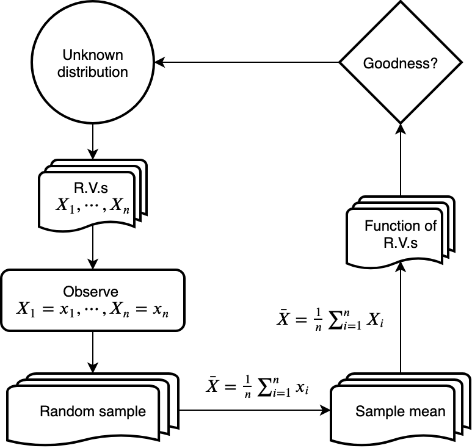

In previous chapters, we learnt how to make various probability arguments if we knew the probability distribution of a random variable. In data analysis, what we often want is the other way around - we usually can observe a dataset, and we want to infer the probability distribution from which the data is generated.

A simplified but widely encountered scenario is when we observe a random sample  from a probability distribution of interest. What we would like to do is to use this sample to estimate some properties of the unknown probability distribution. For example, using the sample mean as an estimator for the population mean.

Suppose each observation  is a realized value of a random variable  where  is generated from this unknown probability distribution of interest.

$\bar{X}$ is called a `statistic` of $X_1, \cdots, X_n$. A statistic is a function of the observable random variables in a sample. The probability distribution of a statistic is called the `sampling distribution` of this statistic.

The above procedure can be summarized as we want to estimate the unknown probability distribution with the sampling distribution of some statistics. For example, we want to use the sample mean to estimate the mean of the unknown distribution. The goodness of this estimation can be quantified by $|\bar{X} - \mu|$ where $\mu$ is the mean of the underlying probability distribution.

In this chapter, we will learn some theory to justify the goodness of this estimation.

## Chebyshev's inequality

Let $X$ be a random variable with mean $\mu$ and variance $\sigma^2$. Then for any positive number $k$, we have

$$
P\left( |X - \mu| \geq k\sigma \right) \leq \frac{1}{k^2}
$$

**Proof:** we assume $X$ to be a continuous random variable where $E[X] = \mu$ and $Var(X) = \sigma^2$. The proof for discrete random variables is very similar. Recall that

$$
Var(X) = E\left[(X - \mu)^2\right]
$$

Suppose the density function of $X$ is $f(X)$, then

$$
Var(X) = \int_{-\infty}^\infty (x-\mu)^2 f(x)dx = \sigma^2
$$

Now we take a closer look at the probability of the event:

$$
\begin{aligned}
    P( |X - \mu| \geq k\sigma) &= \int_{|X-\mu| \geq k\sigma} f(x)dx \\\\
    &\leq \int_{|X-\mu| \geq k\sigma} \frac{(X-\mu)^2}{k^2\sigma^2} f(x)dx \quad \cdots \frac{|X-\mu|}{k\sigma} \geq 1 \\\\
    &= \frac{1}{k^2\sigma^2} \int_{|X-\mu| \geq k\sigma} (X-\mu)^2 f(x)dx \\\\
    &\leq \frac{1}{k^2\sigma^2} \int_{-\infty}^\infty (X-\mu)^2 f(x)dx \\\\
    &= \frac{1}{k^2\sigma^2}Var(X) \\\\
    &= \frac{1}{k^2}
\end{aligned}
$$

## Weak law of large numbers

A theorem we can use to quantify the goodness of the estimation mentioned in the intro is called the `weak law of large numbers`.

Let $X_1, \cdots, X_n$ be a sequence of independent and identically distributed (i.i.d.)  random variables. We assume $E[X_i] = \mu$ and $Var(X_i) = \sigma^2$. Then for any $\epsilon > 0$,

$$
P\left\\{\left| \frac{X_1 + \cdots + X_n}{n} - \mu \right|\geq \epsilon \right\\} \rightarrow 0 \quad \text{as } n \rightarrow \infty
$$

This means to find $E[X]$, we can draw $X_1, \cdots, X_n$ as an i.i.d. sample of $X$, and use $\bar{X} = \frac{X_1 + \cdots + X_n}{n}$ to estimate $E[X]$.

### Convergence in probability

Suppose $X_1, \cdots, X_n$ is a sequence of random variables. $X_n$ `converges in probability` to a number $a$ if

$$
\lim_{n \rightarrow \infty} P(|X_n - a| \geq \epsilon) = 0 \quad \forall a > 0
$$

In other words, for every $\delta > 0$ and $\epsilon > 0$, there exists $n_0$ such that

$$
P(|X_n - a| \geq \epsilon) \leq \delta \quad \forall n \geq n_0
$$

**Proof:** as $X_1, \cdots, X_n$ are i.i.d. random variables each with mean $\mu$ and variance $\sigma^2$,

$$
E\left[ \frac{X_1 + \cdots + X_n}{n} \right] = \frac{E[X_1] + \cdots + E[X_n]}{n} = \mu
$$

which means it is an unbiased estimator. We can also find the variance as

$$
Var\left( \frac{X_1 + \cdots + X_n}{n} \right) = \frac{1}{n^2}\sum_{i=1}^n Var(X_i) = \frac{\sigma^2}{n^2}
$$
Using Chebyshev's inequality,

$$
\begin{aligned}
    P\left\\{\left| \frac{X_1 + \cdots + X_n}{n} - \mu \right|\geq \epsilon \right\\} &= P\left\\{\left| \frac{X_1 + \cdots + X_n}{n} - \mu \right|\geq \frac{\epsilon}{\sigma^*} \cdot \sigma^* \right\\}  \\\\
    &= P\left\\{\left| \frac{X_1 + \cdots + X_n}{n} - \mu \right|\geq k\sigma^* \right\\} \\\\
    &\leq \frac{1}{k^2} = \frac{\sigma^2}{n\epsilon^2}
\end{aligned}
$$

where $\sigma^* = \frac{\sigma}{\sqrt{n}}$ and $k = \frac{\epsilon}{\sigma^*}$. As $n \rightarrow \infty$, $\frac{\sigma^2}{n\epsilon^2} \rightarrow 0$.

## Central limit theorem

Besides the law of large numbers (LLN), another very remarkable result in probability theorem is called the `central limit theorem` (CLT).

Suppose your statistic is the sum of some i.i.d. random variables. The LLN will tell you how close your statistic and the true value is. However, it doesn't tell you the probability distribution of this statistic.

Let $X_1, \cdots, X_n$ be a sequence of i.i.d. random variables with mean $\mu$ and variance $\sigma^2$. The CLT states that the distribution of

$$
\frac{X_1 + \cdots + X_n - n\mu}{\sqrt{n}\sigma}
$$

tends to be standard normal as $n \rightarrow \infty$. That is, for $-\infty < a < \infty$,

$$
P\left\\{\frac{X_1 + \cdots + X_n - n\mu}{\sqrt{n}\sigma} \leq a \right\\} \rightarrow \Phi(a) = \frac{1}{\sqrt{2\pi}}\int_{-\infty}^a e^{-\frac{x^2}{2}}dx \quad \text{as }n \rightarrow \infty
$$

### Example of application

Let $X_1, \cdots, X_n$ be a sequence of i.i.d. random variables, each following a uniform distribution between 0 and 1. Calculate an approximation to $P\left\\{ \sum_{i=1}^n X_i > 6 \right\\}$. Suppose we take $n=10$.

**Solution:** We know $X_i \sim Unif(0, 1)$, so $E[X_i] = 1/2$ and $Var(X_i) = 1/12$. To apply the normal approximation, we need to calculate and standardize the sample mean.

$$
Z = \frac{\sum_{i=1}^{10}X_i - n\mu}{\sqrt{n}\sigma} = \frac{\sum_{i=1}^{10}X_i - 10 \times \frac{1}{2}}{\sqrt{10 \times \frac{1}{12}}}
$$

$$
\begin{aligned}
    P\left\\{ \sum_{i=1}^n X_i > 6 \right\\} &= P\left\\{ Z > \frac{6 - 10 \times \frac{1}{2}}{\sqrt{10 \times \frac{1}{12}}} \right\\} \\\\
    &\approx 1 - P\\{Z \leq \sqrt{1.2}\\} \\\\
    &= 1 - \Phi(\sqrt{1.2}) \approx 0.1367
\end{aligned}
$$

### Normal approximation with the CLT

The law of large numbers and the central limit theorem hold for general i.i.d. random variables (not only the binomial case we discussed in [an earlier chapter](). $X_1, \cdots, X_n$ are i.i.d. random variables each with mean $E[X_i] = \mu$ and variance $Var(X_i) = \sigma^2$. Let $S_n = X_1 + \cdots + X_n$. Then for any fixed $-\infty < a \leq b < \infty$, we have

$$
\lim_{n \rightarrow \infty} P\left( a \leq \frac{S_n - n\mu}{\sigma\sqrt{n}} \leq b \right) = \Phi(b) - \Phi(a)
$$

As an example, suppose we roll 1000 six-sided fair dice and add up the values. Estimate the probability that the sum is at least 3600.

**Solution:** Let $X_1, \cdots, X_{100}$ denote the outcome of the rolls. For the $i$-th roll, $X_i = 1, \cdots, 6$ with probability $1/6$. We can easily calculate

$$
\mu = E[X_i] = \frac{7}{2}, \quad Var(X_i) = \frac{35}{12} = \sigma^2
$$

Let $S_n = X_1 + \cdots + X_{100}$, we have

$$
\begin{aligned}
    P(S_n \geq 3600) &= P\left( \frac{S_n - n\mu}{\sigma\sqrt{n}} \geq \frac{3600 - n\mu}{\sigma\sqrt{n}} \right) \\\\
    &=  P\left( \frac{S_n - n\mu}{\sigma\sqrt{n}} \geq \frac{3600 - 1000 \cdot \frac{7}{2}}{\sqrt{1000 \cdot \frac{35}{12}}} \right) \\\\
    &\approx P\left(\frac{S_n - n\mu}{\sigma\sqrt{n}} \geq 1.852\right) \\\\
    &= 1 - \Phi(1.852) \\\\
    &\approx 0.03
\end{aligned}
$$

The normal approximation also holds when $X_i$ are independent but not necessarily identically distributed.

Let $X_1, \cdots, X_n$ be $n$ independent random variables with $E[X_i] = \mu_i$ and $Var(X_i) = \sigma_i^2$. For fixed $-\infty < a \leq b < \infty$,

$$
\lim_{n \rightarrow \infty} P\left( a \leq \frac{S_n - \sum_{i=1}^n \mu_i}{\sqrt{\sum_{i=1}^n \sigma_i^2}} \leq b \right) = \Phi(b) - \Phi(a)
$$

Therefore, the i.i.d. case can be considered as a special case of this one.

